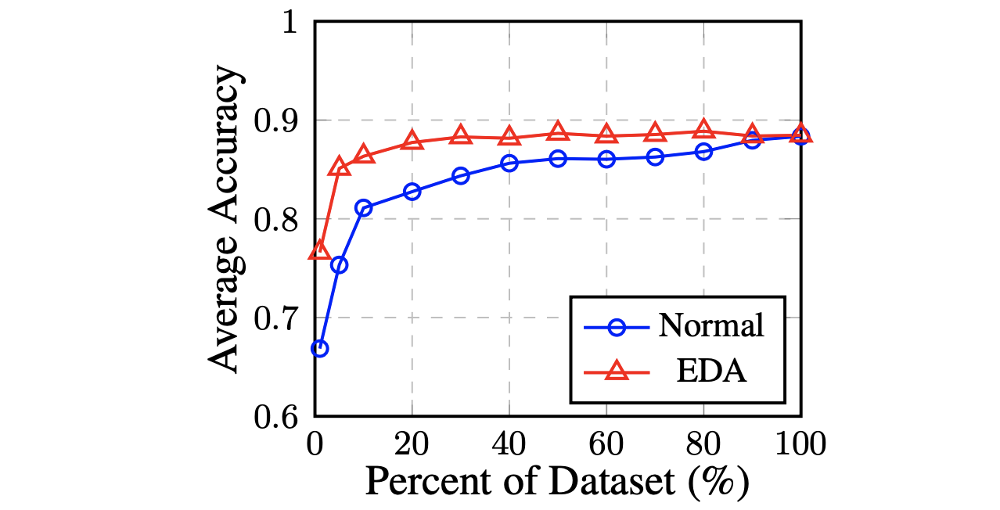

# EDA: Easy Data Augmentation Techniques for Boosting Performance on Text Classification Tasks
[](https://arxiv.org/abs/1901.11196)

For a survey of data augmentation in NLP, see this [repository](https://github.com/styfeng/DataAug4NLP/blob/main/README.md)/this [paper](http://arxiv.org/abs/2105.03075).

This is the code for the EMNLP-IJCNLP paper [EDA: Easy Data Augmentation techniques for boosting performance on text classification tasks.](https://arxiv.org/abs/1901.11196) 

A blog post that explains EDA is [[here]](https://medium.com/@jason.20/these-are-the-easiest-data-augmentation-techniques-in-natural-language-processing-you-can-think-of-88e393fd610). 

Update: find an external implementation of EDA in Chinese [[here]](https://github.com/zhanlaoban/EDA_NLP_for_Chinese).

By [Jason Wei](https://jasonwei20.github.io/research/) and Kai Zou.

Note: **Do not** email me with questions, as I will not reply. Instead, open an issue.

We present **EDA**: **e**asy **d**ata **a**ugmentation techniques for boosting performance on text classification tasks. These are a generalized set of data augmentation techniques that are easy to implement and have shown improvements on five NLP classification tasks, with substantial improvements on datasets of size `N < 500`. While other techniques require you to train a language model on an external dataset just to get a small boost, we found that simple text editing operations using EDA result in good performance gains. Given a sentence in the training set, we perform the following operations:

- **Synonym Replacement (SR):** Randomly choose *n* words from the sentence that are not stop words. Replace each of these words with one of its synonyms chosen at random.
- **Random Insertion (RI):** Find a random synonym of a random word in the sentence that is not a stop word. Insert that synonym into a random position in the sentence. Do this *n* times.
- **Random Swap (RS):** Randomly choose two words in the sentence and swap their positions. Do this *n* times.
- **Random Deletion (RD):** For each word in the sentence, randomly remove it with probability *p*.

<p align="center">  </p>
Average performance on 5 datasets with and without EDA, with respect to percent of training data used.

# Usage

You can run EDA any text classification dataset in less than 5 minutes. Just two steps:

### Install NLTK (if you don't have it already):

Pip install it.

```bash
pip install -U nltk
```

Download WordNet.
```bash
python
>>> import nltk; nltk.download('wordnet')
```

### Run EDA

You can easily write your own implementation, but this one takes input files in the format `label\tsentence` (note the `\t`). So for instance, your input file should look like this (example from stanford sentiment treebank):

```
1   neil burger here succeeded in making the mystery of four decades back the springboard for a more immediate mystery in the present 
0   it is a visual rorschach test and i must have failed 
0   the only way to tolerate this insipid brutally clueless film might be with a large dose of painkillers
...
```

Now place this input file into the `data` folder. Run 

```bash
python code/augment.py --input=<insert input filename>
```

The default output filename will append `eda_` to the front of the input filename, but you can specify your own with `--output`. You can also specify the number of generated augmented sentences per original sentence using `--num_aug` (default is 9). Furthermore, you can specify different alpha parameters, which approximately means the percent of words in the sentence that will be changed according to that rule (default is `0.1` or `10%`). So for example, if your input file is `sst2_train.txt` and you want to output to `sst2_augmented.txt` with `16` augmented sentences per original sentence and replace 5% of words by synonyms (`alpha_sr=0.05`), delete 10% of words (`alpha_rd=0.1`, or leave as the default) and do not apply random insertion (`alpha_ri=0.0`) and random swap (`alpha_rs=0.0`), you would do:

```bash
python code/augment.py --input=sst2_train.txt --output=sst2_augmented.txt --num_aug=16 --alpha_sr=0.05 --alpha_rd=0.1 --alpha_ri=0.0 --alpha_rs=0.0
```

Note that at least one augmentation operation is applied per augmented sentence regardless of alpha (if greater than zero). So if you do `alpha_sr=0.001` and your sentence only has four words, one augmentation operation will still be performed. Of course, if one particular alpha is zero, nothing will be done. Best of luck!

# Citation
If you use EDA in your paper, please cite us:
```
@inproceedings{wei-zou-2019-eda,
    title = "{EDA}: Easy Data Augmentation Techniques for Boosting Performance on Text Classification Tasks",
    author = "Wei, Jason  and
      Zou, Kai",
    booktitle = "Proceedings of the 2019 Conference on Empirical Methods in Natural Language Processing and the 9th International Joint Conference on Natural Language Processing (EMNLP-IJCNLP)",
    month = nov,
    year = "2019",
    address = "Hong Kong, China",
    publisher = "Association for Computational Linguistics",
    url = "https://www.aclweb.org/anthology/D19-1670",
    pages = "6383--6389",
}
```

# Experiments

The code is not documented, but is [here](https://github.com/jasonwei20/eda_nlp/tree/master/experiments) for all experiments used in the paper. See [this issue](https://github.com/jasonwei20/eda_nlp/issues/10) for limited guidance.


